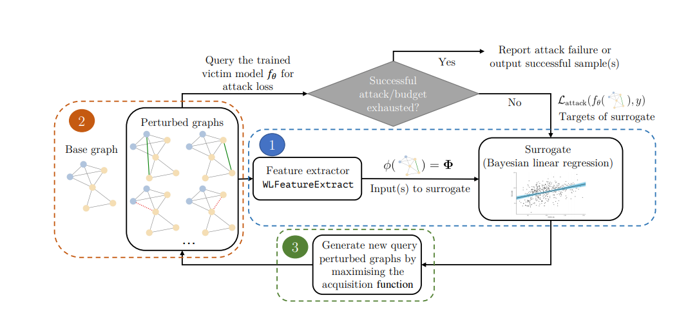

# Adversarial Attacks on Graph Classification via Bayesian Optimisation @ NeurIPS 2021



This repository contains the official implementation of GRABNEL, a Bayesian optimisation-based adversarial
attack agent to conduct on graph classification models. GRABNEL currently supports various topological
attacks, such as via edge flipping (incl. both addition or deletion), node injection and edge swapping. We also include
implementations of a number of baseline methods including random search, genetic algorithm [1] and a gradient-based white-box
attacker (available on some victim model choices). We also implement a number of victim model, namely:
- Graph convolution networks (GCN) [2]
- Graph isomorphism networks (GIN) [3]
- ChebyGIN [4] (only for MNIST-75sp task)
- Graph U-Net [5]
- S2V (only for the ER Graph task in [1])

For details please take a look at our [abstract](https://arxiv.org/abs/2111.02842) / [pdf](https://arxiv.org/pdf/2111.02842).

The code repository also contains instructions for the TU datasets [6] in the DGL framework, as well as the MNIST-75sp
dataset in [4]. For the Twitter dataset we used for node injection tasks, we are not authorised to redistribute the dataset and you
have to ask for permission from the authors of [7] directly.

If you find our work to be useful for your research, please consider citing us:

Wan, Xingchen, Henry Kenlay, Binxin Ru, Arno Blaas, Michael A. Osborne, and Xiaowen Dong. "Adversarial Attacks on Graph Classifiers via Bayesian Optimisation." In Thirty-Fifth Conference on Neural Information Processing Systems. 2021.

Or in bibtex:
```
@inproceedings{wan2021adversarial,
  title={Adversarial Attacks on Graph Classifiers via Bayesian Optimisation},
  author={Wan, Xingchen and Kenlay, Henry and Ru, Binxin and Blaas, Arno and Osborne, Michael and Dong, Xiaowen},
  booktitle={Thirty-Fifth Conference on Neural Information Processing Systems},
  year={2021}
}
```

## Instructions for use

0. Install the required packages in requirements.txt

###For TU Dataset(s):

1. Train a selected architecture (GCN/GIN). Taking an example of GCN training on the PROTEINS dataset. By default DGL
will download the requested dataset under ```~/.dgl``` directory. If it throws an error, you might have to manually
download the dataset and add to the appropriate directory.
```commandline
python3 train_model.py --dataset PROTEINS --model gcn --seed $YOUR_SEED 
```
This by default deposits the trained victim model under ```src/output/models``` and the training log under ```src/output/training_logs```.
2. Evaluate the victim model on a separate test set. Run
```commandline
python3 evaluate_model.py --dataset PROTEINS --seed $YOUR_SEED  --model gcn
```
This by default will create evaluation logs under ```src/output/evaluation_logs```.

3. Run the attack algorithm. 
```commandline
cd scripts && python3 run_bo_tu.py --dataset PROTEINS --save_path $YOUR_SAVE_PATH --model_path $YOUR_MODEL_PATH --seed $YOUR_SEED --model gcn
```
With no method specified, the script runs GRABNEL by default. You may use the ```-m ``` to specify if, for example, you'd like to run 
one of the baseline methods mentioned above instead.


###For the MNIST-75sp task
For MNIST-75sp, we use the pre-trained model released by the authors of [4] as the victim model, so there is no need
to train a victim model separately (unless you wish to).

1. Generate the MNIST-75sp dataset. Here we use an adapted script from [4], but added a converter to ensure that the 
dataset generated complies with the rest of our code base (DGL-compliant, etc). You need to download the MNIST dataset
beforehand (or use the torchvision download facility. Either is fine)

```commandline
cd data && python3 build_mnist.py -D mnist -d $YOUR_DATA_PATH -o $YOUR_SAVE_PATH  
```

The output should be a pickle file ```mnist_75sp.p```. Place it under ```$PROJECT_ROOT/src/data/```

2. Download the pretrained model from https://github.com/bknyaz/graph_attention_pool. The pretrained checkpointed model
we use is ```checkpoint_mnist-75sp_139255_epoch30_seed0000111.pth.tar```. Deposit the model under ```src/output/models```


3. Run attack algorithm.
```commandline
cd scripts && python3 run_bo_image_classification.py --dataset mnist
```

## References
[1] Dai, Hanjun, Hui Li, Tian Tian, Xin Huang, Lin Wang, Jun Zhu, and Le Song. "Adversarial attack on graph structured data." In International conference on machine learning, pp. 1115-1124. PMLR, 2018.

[2] Kipf, Thomas N., and Max Welling. "Semi-supervised classification with graph convolutional networks." arXiv preprint arXiv:1609.02907 (2016).

[3] Xu, Keyulu, Weihua Hu, Jure Leskovec, and Stefanie Jegelka. "How powerful are graph neural networks?." arXiv preprint arXiv:1810.00826 (2018).

[4] Knyazev, Boris, Graham W. Taylor, and Mohamed R. Amer. "Understanding attention and generalization in graph neural networks." NeurIPS (2019).

[5] Gao, Hongyang, and Shuiwang Ji. "Graph u-nets." In international conference on machine learning, pp. 2083-2092. PMLR, 2019.

[6] Morris, Christopher, Nils M. Kriege, Franka Bause, Kristian Kersting, Petra Mutzel, and Marion Neumann. "Tudataset: A collection of benchmark datasets for learning with graphs." arXiv preprint arXiv:2007.08663 (2020).

[7] Vosoughi, Soroush, Deb Roy, and Sinan Aral. "The spread of true and false news online." Science 359, no. 6380 (2018): 1146-1151.


## Acknowledgements

The repository builds, directly or indirectly, on multiple open-sourced code based available online. The authors would like to express their
gratitudes towards the maintainers of the following repos:

1. https://github.com/Hanjun-Dai/graph_adversarial_attack
2. https://github.com/DSE-MSU/DeepRobust
3. https://github.com/HongyangGao/Graph-U-Nets
4. https://github.com/xingchenwan/nasbowl
5. https://github.com/xingchenwan/nasbowl
6. The Deep graph library team
7. The grakel team (https://ysig.github.io/GraKeL/0.1a8/)

